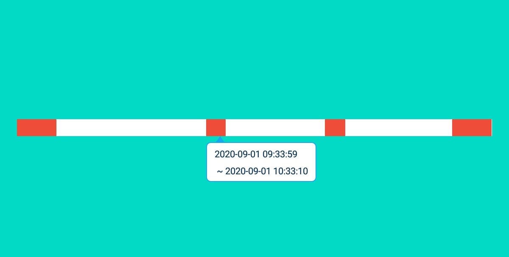

# SectionProgressBar
Android 分段 间隔 显示 进度条 Android Display progress bar at intervals
### 效果图


### 需求

1. 分段显示一天的报警进度条，点击报警区域可以弹出报警数据

2. 点击报警区域弹出报警的开始时间与结束时间

3. 显示区域的数据格式（以下伪代码，就是个说明）：

   ```java
   List<String> lists,{2020-09-01 00:00:00,2020-09-01 02:00:00}
   list[0]=2020-09-01 00:00:00; //开始时间
   list[1]=2020-09-01 02:00:00; //结束
   
   ```

   

### 原理

1. 获取平均一秒的长度px是多少 = 测量到的自定义组件长度 / 24 * 60* 60

2. 因为是要做列表展示的，所以需要一个其实长度是多少，也就是每天**零点**的时间戳是多少，参数：mStartSection

3. 绘制算法：每一个报警显示的分段都有开始的时间与结束的时间，通过开始与结束的时间戳与每天零点的时间戳相减既可得出每一个报警分段：

   ```java
   int startSection = (int) ((timeShaftItem.getStartSection() - mStartSection) / mConvertUnit);
   int endSection = (int) ((timeShaftItem.getEndSection() - mStartSection) / mConvertUnit);
   ```

   mConvertUnit是转换单位，这里是1000毫秒，即1秒。最后通过startSection与endSection计算每个分段要显示的报警区域：

   ```java
   int startX = (int) (startSection * mPixelsPer);
   int endX = (int) (endSection * mPixelsPer);
   ```

   最后通过画笔cavas绘制出，我们需要的区块：

   ```java
   canvas.drawRect(startX, 0, endX, getHeight(), mRegionPaint);
   ```

4. 点击区域的算法要怎么搞呢，聪明的同学应该想到了吧，哈哈~

   不扯了，算法如下：

   ```java
   ShaftRegionItem timeShaftItem = mShaftItems.get(i);
   int startSection = (int) ((timeShaftItem.getStartSection() - mStartSection) / mConvertUnit);
   int endSection = (int) ((timeShaftItem.getEndSection() - mStartSection) / mConvertUnit);
   int startX = (int) (startSection * mPixelsPer);
   int endX = (int) (endSection * mPixelsPer);
   //存下坐标，给点击判断用；
   timeShaftItem.setStartX(startSection * mPixelsPer);
   timeShaftItem.setEndX(endSection * mPixelsPer);
   mShaftItems.set(i, timeShaftItem);
   ```

   ```java
      for (ShaftRegionItem item : mShaftItems) {
           if (x >= item.getStartX() && x <= item.getEndX()) {
               Log.e(TAG, "ACTION_UP  +  " + item.toString());
               if (clickSectionListener != null) {
                   clickSectionListener.clickBar(item, viewY);
               }
               break;
           }
       }
   ```

   ```javascript
       public boolean onTouchEvent(MotionEvent event) {
           int actionType = event.getActionMasked();
           switch (actionType) {
               case MotionEvent.ACTION_UP:
                   clickBar(event.getX(), getBottom());
                   break;
           }
           return true;
       }
   ```

   看到了没哟，是不是很简单，没啥难度，就是看到你在点击的时候，判断你点击的x轴坐标是否在我们缓存好的每个显示区域开始与结束的X坐标区间内，是的话就弹咯~

### 愿景

其实里面还有个问题是弹出框的定位与显示问题，没找到合适的弹出方式，就先这样了~